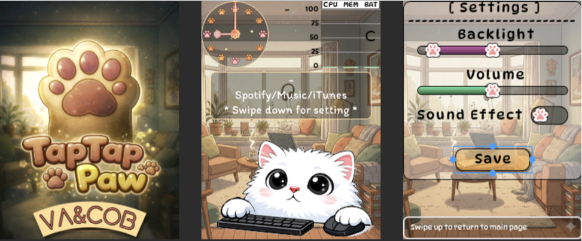

# 🐾 TapTapPaw

[](https://creativecommons.org/licenses/by-nc/4.0/)
[](https://www.electronjs.org/)
[](https://platformio.org/)

**TapTapPaw**  is a **interactive desktop companion** that turns your everyday computer activity into a cute, living desk experience.

When you type on your keyboard, tiny paw taps animate on the screen.
When you move your mouse, the character reacts playfully.
Soft sound effects respond to clicks and keystrokes, making your workflow feel alive.

Behind the cuteness is a real-time hardware bridge powered by an [ESP32 2.8" purple capacitive touch screen](https://s.click.aliexpress.com/e/_c3uiGvqR) — streaming system stats, clock data, and media information directly from your computer.

> TapTapPaw is not just a monitor. It’s a tiny animated desk buddy that reacts to you in real time.




## ✨ Key Features
* 🕒 **Live Clock** — Analog or digital clock with animated hands
* 🖱️ **Input Awareness** — Reacts to keyboard and mouse activity
* 📊 **System Telemetry** — CPU, RAM, battery level, charging status
* 🎵 **Music Status** — Displays current playback state and track info
* 🧸 **Cute UI** — Designed with playful animations using LVGL
* 🔌 **Low-Latency Serial Link** — Efficient binary protocol over USB

## 📂 Project Structure

```
TapTapPaw/
├── app/        # Desktop tray application (Electron + Node.js)
└── sketch/     # ESP32 firmware (PlatformIO + LVGL)
```

## 🖥️ Desktop Application (`app/`)
The desktop app runs quietly in the system tray (Windows) or menu bar (macOS). It listens for global events and streams structured data to the ESP32 over USB serial.

### Capabilities
* Global keyboard & mouse monitoring
* System stats polling (CPU, RAM, Battery, Time)
* Media playback detection (title / artist / state)
* Automatic serial port discovery
* Cross-platform support (macOS & Windows)

### Installation (End Users)

#### macOS
1. Download the latest `.dmg` from **Releases**
2. Drag **TapTapPaw.app** into **Applications**
3. Grant **Accessibility** and **Input Monitoring** permissions:

   * System Settings → Privacy & Security
4. Launch the app and select the ESP32 serial port

[Download macOS Apple Silicon](https://github.com/VaAndCob/TapTapPaw/releases/download/v1.0.0/TapTapPaw-1.0.0-arm64.dmg)

#### Windows
1. Download the latest `.exe` installer from **Releases**
2. Run the installer
3. Launch TapTapPaw from the system tray
4. Select your ESP32 serial port

[Download Windows x64](https://github.com/VaAndCob/TapTapPaw/releases/download/v1.0.0/TapTapPaw.Setup.1.0.0.exe)

---

### Development (Desktop App)

```bash
cd app
npm install
npm run dev
```

Build binaries:

```bash
npm run build:mac   # macOS
npm run build:win   # Windows
```

## 🔌 ESP32 Firmware (`sketch/`)
The firmware runs on an ESP32 and renders visuals using **LVGL**. It parses incoming binary packets and updates animations in real time.

### Firmware Setup
1. Install **VS Code**
2. Install the **PlatformIO IDE** extension
3. Open the `sketch/` folder
4. Connect ESP32 via USB
5. Click **Upload** in PlatformIO

### Quick start, flash and go, no code needed
[Flash Firmware Online](https://vaandcob.github.io/webpage/src/index.html)


## 📡 Serial Protocol Overview
Communication uses a lightweight binary protocol optimized for embedded devices.

* Baud rate: **115200**
* Start byte: `0xFF`
* Length-prefixed payloads

### Status Packet (≈100 ms)

| Byte | Field | Description     |
| ---- | ----- | --------------- |
| 0    | START | `0xFF`          |
| 1    | TYPE  | `0x01` (Status) |
| 2    | LEN   | Payload length  |
| 3    | EVT   | Input bitmask   |
| 4    | CPU   | CPU usage (%)   |
| 5    | MEM   | RAM usage (%)   |
| 6    | BAT   | Battery (%)     |
| 7    | CHG   | Charging (1/0)  |
| 8    | HOUR  | Hour (0–23)     |
| 9    | MIN   | Minute (0–59)   |
| 10   | SEC   | Second (0–59)   |
| 11   | MEDIA | Media state     |

### Music Packet (On Change)

| Byte | Field  | Description          |
| ---- | ------ | -------------------- |
| 0    | START  | `0xFF`               |
| 1    | TYPE   | `0x02` (Music)       |
| 2    | LEN    | Total payload length |
| 3    | T_LEN  | Title length         |
| …    | TITLE  | UTF-8 title          |
| …    | A_LEN  | Artist length        |
| …    | ARTIST | UTF-8 artist         |

## 🧠 Tech Stack
* **Electron** — Desktop application framework
* **Node.js** — System telemetry & serial transport
* **uiohook-napi** — Global input hooks
* **node-serialport** — USB serial communication
* **ESP32** — Embedded controller
* **LVGL** — UI and animation engine

## 🎯 Project Vision
TapTapPaw is designed to be:

* Open-source
* Hardware-friendly
* Cute but technically solid
* Easy to extend (new widgets, new animals, new data sources)

## 📜 License

Code: MIT License (Non-Commercial)  
3D Designs: CC BY-NC-SA 4.0  
Commercial use is strictly prohibited. For licensing inquiries, contact Va&Cob

---

[](https://www.buymeacoffee.com/vaandcob)