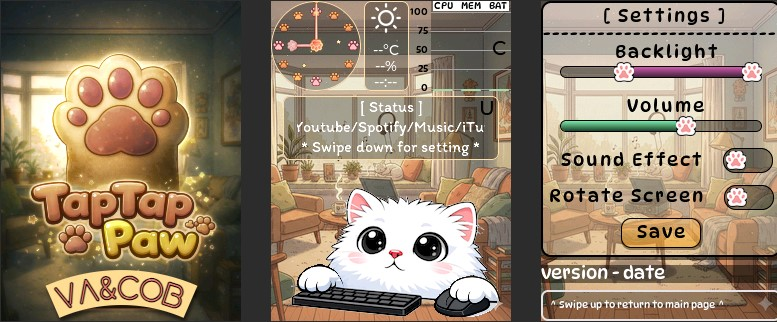
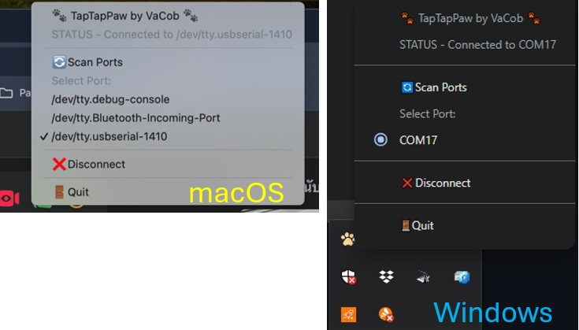
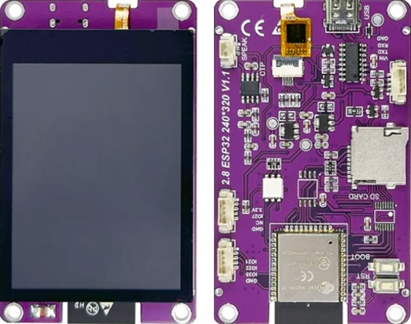
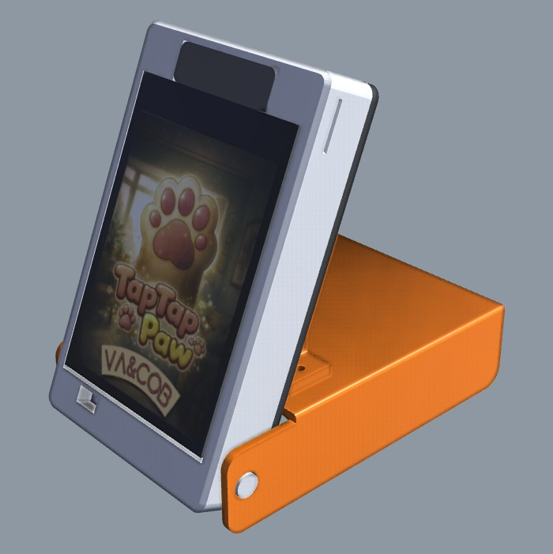

# 🐾 TapTapPaw

[](https://creativecommons.org/licenses/by-nc/4.0/)
[](https://www.electronjs.org/)
[](https://platformio.org/)

**TapTapPaw** is an **interactive desktop companion** inspired by the Bongo Cat meme, turning your everyday computer activity into a cute, living desk experience.

When you type on your keyboard, tiny paw taps animate on the screen.
When you move your mouse, the character reacts playfully.
Soft sound effects respond to clicks and keystrokes, making your workflow feel alive.

Behind the cuteness is a real-time hardware bridge, designed for boards like the recommended [ESP32 2.8" purple capacitive touch screen](https://s.click.aliexpress.com/e/_c3uiGvqR). It streams system stats, clock data, and media information directly from your computer.

> TapTapPaw is not just a monitor. It’s a tiny animated desk buddy that reacts to you in real time.
## [Wartch on Youtube](https://youtu.be/Lp3rQJZUCo0)



## ✨ Key Features
* 🕒 **Live Clock** — Analog or digital clock with animated hands
* 🖱️ **Input Awareness** — Reacts to keyboard and mouse activity
* 📊 **System Telemetry** — CPU, RAM, battery level, charging status
* 🎵 **Music Status** — Displays current playback state and track info (Youtube/Spotify/Music)
* ☀️ **Weather Condition** — Displays current weather condition by current geolocation
* 🧸 **Cute UI** — Designed with playful animations using LVGL
* 🔌 **Low-Latency Serial Link** — Efficient binary protocol over USB
* 🌗 **Auto backlight**— Shifts brightness based on ambient light levels.
* 🔄 **Screen Rotation** — Swtichable screen rotation 180 degree
* 🔌 **Auto sleep** — Display will be automatically turned off after disconnected for 5 minutes

## 📂 Project Structure

```
TapTapPaw/
├── app/        # Desktop tray application (Electron + Node.js)
└── sketch/     # ESP32 firmware (PlatformIO + LVGL)
```

## 🖥️ Desktop Application (`app/`)
The desktop app runs quietly in the system tray (Windows) or menu bar (macOS). It listens for global events and streams structured data to the ESP32 over USB serial.



### Capabilities
* Global keyboard & mouse monitoring
* System stats polling (CPU, RAM, Battery, Time)
* Media playback detection (title / artist / state)
* Automatic serial port discovery
* Cross-platform support (macOS & Windows)

### Installation (End Users)

#### macOS
1. Download the latest `.dmg` from **Releases**
2. Drag **TapTapPaw.app** into **Applications**
3. Grant **Accessibility** and **Input Monitoring** permissions:

   * System Settings → Privacy & Security
4. Launch the app and select the ESP32 serial port

[Download macOS Apple Silicon](https://github.com/VaAndCob/TapTapPaw/releases/download/v1.0.2/TapTapPaw-1.0.2-arm64.dmg)

#### Windows
1. Download the latest `.exe` installer from **Releases**
2. Run the installer
3. Launch TapTapPaw from the system tray
4. Select your ESP32 serial port

[Download Windows x64](https://github.com/VaAndCob/TapTapPaw/releases/download/v1.0.2/TapTapPaw.Setup.1.0.2.exe)

---

### Development (Desktop App)

```bash
cd app
npm install
npm run dev
```

Build binaries:

```bash
npm run build:mac   # macOS
npm run build:win   # Windows
```

## 🔌 ESP32 Firmware (`sketch/`)
The firmware runs on an ESP32 and renders visuals using **LVGL**. It parses incoming binary packets and updates animations in real time.

## Bill of Materials (BOM) To build the full TapTapPaw, you need:

1. Recommended Board [ESP32 2.8" purple capacitive touch screen](https://s.click.aliexpress.com/e/_c3uiGvqR)


2. Speaker 1 Watt 9x22 mm. → https://s.click.aliexpress.com/e/_c3fTkgxl
3. Screw M2.3 x 4 = 4 pcs
4. USB C Cable: To connect to your PC/Mac.

### Firmware Setup
1. Install **VS Code**
2. Install the **PlatformIO IDE** extension
3. Open the `sketch/` folder
4. Connect ESP32 via USB
5. Click **Upload** in PlatformIO

(`For resistive touch screen only`) Touch screen calibration will be displayed during the first run, but can also be manually entered by pressing the RESET button and releasing, then pressing the BOOT (GPIO_0) button within one second and holding it for a second.

### Quick start, flash and go, no code needed
[Flash Firmware Online](https://vaandcob.github.io/webpage/src/index.html?tab=taptappaw)


## 📡 Serial Protocol Overview
Communication uses a lightweight binary protocol optimized for embedded devices.

* Baud rate: **115200**
* Start byte: `0xFF`
* Length-prefixed payloads

### Status Packet (≈100 ms)

| Byte | Field | Description     |
| ---- | ----- | --------------- |
| 0    | START | `0xFF`          |
| 1    | TYPE  | `0x01` (Status) |
| 2    | LEN   | Payload length  |
| 3    | EVT   | Input bitmask   |
| 4    | CPU   | CPU usage (%)   |
| 5    | MEM   | RAM usage (%)   |
| 6    | BAT   | Battery (%)     |
| 7    | CHG   | Charging (1/0)  |
| 8    | HOUR  | Hour (0–23)     |
| 9    | MIN   | Minute (0–59)   |
| 10   | SEC   | Second (0–59)   |
| 11   | MEDIA | Media state     |

### Music Packet (On Change)

| Byte | Field  | Description          |
| ---- | ------ | -------------------- |
| 0    | START  | `0xFF`               |
| 1    | TYPE   | `0x02` (Music)       |
| 2    | LEN    | Total payload length |
| 3    | T_LEN  | Title length         |
| …    | TITLE  | UTF-8 title          |
| …    | A_LEN  | Artist length        |
| …    | ARTIST | UTF-8 artist         |

### Weather Packet (On Change)

| Byte | Field         | Description                    |
| ---- | ------------- | ------------------------------ |
| 0    | START         | `0xFF`                         |
| 1    | TYPE          | `0x03` (Weather)               |
| 2    | LEN           | Payload length (5)             |
| 3    | W_GROUP       | Weather group ID (0-4)         |
| 4    | TEMP_C        | Temperature in Celsius         |
| 5    | HUMID         | Humidity (%)                   |
| 6    | OBSERVED_H    | Observation time hour (0-23)   |
| 7    | OBSERVED_M    | Observation time minute (0-59) |

The weather group ID corresponds to conditions like Clear (0), Clouds (1), Rain (2), etc. The device firmware uses this ID and the observation time to display the correct icon (e.g., sun or moon for clear skies).

## 🧠 Tech Stack
* **Electron** — Desktop application framework
* **Node.js** — System telemetry & serial transport
* **uiohook-napi** — Global input hooks
* **node-serialport** — USB serial communication
* **ESP32** — Embedded controller
* **LVGL** — UI and animation engine

## 🎯 Project Vision
TapTapPaw is designed to be:

* Open-source
* Hardware-friendly
* Cute but technically solid
* Easy to extend (new widgets, new animals, new data sources)

## 📦 3D Print Case

This project includes a custom-designed 3D printable case. Its foldable style and adjustable tilt angle make it portable and easy to position on your desk.

[Grab 3d Print here](https://makerworld.com/en/models/2499316-taptappaw-esp32-2-8-foldable-stand-case-companion?fbclid=IwY2xjawQfJctleHRuA2FlbQIxMABicmlkETEwTWg0V3d3bmE3dGd1S3Rlc3J0YwZhcHBfaWQQMjIyMDM5MTc4ODIwMDg5MgABHoWFr-hVyT1JCsCFT33WxL08UYZYpE7FZSkUTtOcf3qJHZyDQTpv6TiDYxLX_aem_Cnj7UKn6urSzDVcwXFKpkw#profileId-2747312)




## 📜 License

Code: MIT License (Non-Commercial)  
3D Designs: CC BY-NC-SA 4.0  
Commercial use is strictly prohibited. For licensing inquiries, contact Va&Cob

---

[](https://www.buymeacoffee.com/vaandcob)